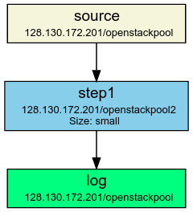
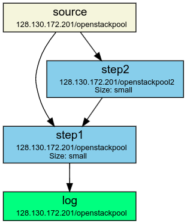

The VISP Ecosystem consists of two major components: the VISP Marketplace and the VISP Runtime. The VISP Marketplace aims at creating an ecosystem for IoT-based topologies by minimizing the required effort for the user to design a topology. The VISP Runtime complements the VISP Marketplace, by providing a platform to execute the previously designed topologies.

# Architecture

TBD


# Runtime

TBD

## Web GUI

TBD

## Resource Provider

TBD

## Reasoner

TBD

## Topology Parser

The VISP topology parser is used to make sense of input files in the **VISP topology description language** format. Such files are either created manually by the user (or by the Topology Builder in the VISP Marketplace) or they can be generated automatically by the VISP Runtime in the process of executing topology updates at runtime.

The parser is based on Antlr4 and uses a fairly simple grammar. An exemplary input file for a topology with a source, two processing nodes and a sink may look like the following:

```
$source = Source() {
  concreteLocation = 192.168.0.1/openstackpool,
  type             = source,
  outputFormat     = "temperature data from sensor XYZ",
  #meaningless for sources and should be ignored by parser:
  expectedDuration = 15
}

$step1 = Operator($source) {
  allowedLocations = 192.168.0.1/openstackpool 192.168.0.2/* 192.168.0.3/awsCloud 192.168.0.4/fogPool 192.168.0.5/openstackpool,
  concreteLocation = 192.168.0.2/openstackpool2,
  inputFormat      = step1,
  type             = step1,
  outputFormat     = step2,
  size             = small,
  stateful = false
}

$step2 = Operator($step1) {
  allowedLocations = 192.168.0.1/openstackpool,
  inputFormat      = step1,
  type             = "step2",
  outputFormat     = "step3",
  size             = small,
  stateful         = true,
  expectedDuration = 15,
  scalingCPUThreshold = 20,
  scalingMemoryThreshold = 55,
  queueThreshold = 11
}
$log = Sink($step5) {
 concreteLocation = 192.168.0.1/openstackpool,
 inputFormat      = "transformed data from step 5",
 type             = "logger for temperature data",
}
```

Each node in the topology is represented by an entry starting with `$<name> =` defining the node's identifier.
This is followed by a **type** - either Source, Operator or Sink. One or more sources are then defined in brackets where each source refers to a node that must also be defined in the same topology file (but not necessarily in a line before they are used as sources).

In curly braces, the following options can be specified:

* `concreteLocation`<br />
Location (rabbitmq host, resource pool) where the operator should be deployed<br /><br />
* `allowedLocations`<br />
List of locations where the operator can be deployed (a concrete location is picked from this list if none is explicitly provided). Each location is separated from the next one with a single space. <br /><br />
* `type`<br />
<br />The type is an identifier for the abstract node function<br />
* `inputFormat`<br />
Which kinds of input format are expected<br /><br />
* `outputFormat`<br />
Which output formats are produced<br /><br />
* `size`<br />
How much disk space does the operator use (either *small*, *medium* or *large*)<br /><br />
* `stateful`<br />
Whether or not the operator shows a stateful behavior<br /><br />
* `expectedDuration`<br />
How long is the expected duration to process one item (in seconds)
<br /><br />
* `scalingCPUThreshold`<br />
CPU threshold
<br /><br />
* `scalingMemoryThreshold`<br />
Memory threshold
<br /><br />
* `queueThreshold`<br />
Queue threshold

### Locations

Each node is deployed in one or more locations. A location is uniquely specified by an infrastructure host and a resource pool. The first is responsible for routing the data stream inputs while the second is the identifier of the (cloud) resource pool where the operator is actually executed. An infrastructure host can have an arbitrary number of resource pools. Each resource pool belongs to exactly one infrastructure host. Two different infrastructure hosts can have resource pools with the same identifier; however, they still refer to different actual pools.

If a start (&lowast;) is used instead of a concrete resource pool name, the VISP instance will automatically pick one of the available resource pools to deploy the container.


# Processing Nodes

Processing nodes are the building blocks performing the actual useful work in a topology. Each processing node has a type and a unique identifier. There may be more than one processing node of the same type (but they must have different identifiers then). Processing nodes have arbitrary many input sources (other processing nodes) and can in turn forward their output to arbitrarily many (child) processing nodes.

A processing node is implemented as a docker image. Whenever a node is instantiated by the VISP runtime, a docker container is created from that docker image on (one of) the specified resource pool(s).

TODO (Christoph): explain how a processing node must be implemented in that docker image

The VISP runtime may decide to replicate a processing node at runtime; this means that more than one docker container is deployed from the same docker image. The reason for this replication is to have more copies of the same processing nodes in order to partition the input data and divide the work between all the replicas.

## Update mechanism

One interesting implementation detail concerns the way the running containers are handled in case of a topology update. Imagine A topology consisting of a source node *Source*, a processing operator *Step1* and a sink node *Sink*. The following figure displays such a topology.

<div class="screenshot-holder">
<a href="img/quickstart/topology_example1.png" data-title="Configure Data Provider" data-toggle="lightbox"></a>
<a class="mask" href="img/quickstart/topology_example1.png" data-title="Configure Data Provider" data-toggle="lightbox"><i class="icon fa fa-search-plus"></i></a>
</div>

Initially, *Step1* is set up to connect to *Source*'s queue and handle messages that are put on that queue (its identifier would be **192.168.0.1/Source>Step1**). Now, let's assume the topology is changed such that a new operator *Step2* is inserted that consumes from *Source*. Also, *Step1* is changed so that it now receives messages from both *Source* **and** *Step2* (as seen in the following figure):

<div class="screenshot-holder">
<a href="img/quickstart/topology_example2.png" data-title="Configure Data Provider" data-toggle="lightbox"></a>
<a class="mask" href="img/quickstart/topology_example2.png" data-title="Configure Data Provider" data-toggle="lightbox"><i class="icon fa fa-search-plus"></i></a>
</div>

While it is easy to set up a new instance for Step2 and point it to the correct queue (**192.168.0.1/Source>Step2**) on setup, it is a little bit more tricky to change *Step1*. Ultimately, it needs to listen to both **192.168.0.1/Source>Step1** and **192.168.0.1/Step2>Step1**. In order to communicate this change to the container *without interrupt the current processing*, the following mechanism is used:

* Write an update command to a specific file inside the docker container (<code>/root/topologyUpdate.txt</code>).
* This update command to update *Step1* in our example would be: <code>ADD 192.168.0.1/Step2>Step1</code>
* The docker container has a thread that automatically scans the file system for the addition of new files
* Once this threads notices the new file, its content is read and the appropriate update is executed
* In this case, a new connection to the queue **192.168.0.1/Step2>Step1** is created and the docker container will now listen to messages coming from that queue.

# Data Provider

While in a real scenario, the input data would come from some device, a sensor or some other data source, the VISP Data Provider can be used to generate a stream of test data to evaluate the created topology. A few different types of such data streams are already implemented (e.g. MachineData, SequentialWait, ...) and for those one just has to point the data provider to the infrastructure host and resource pool.
