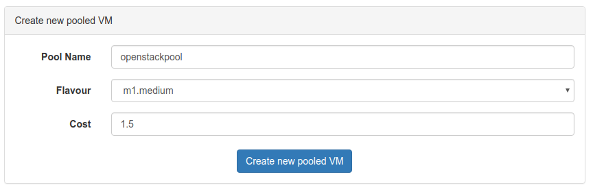
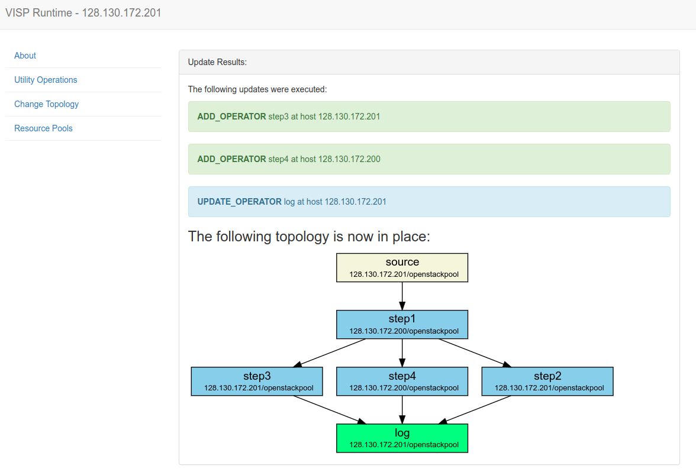
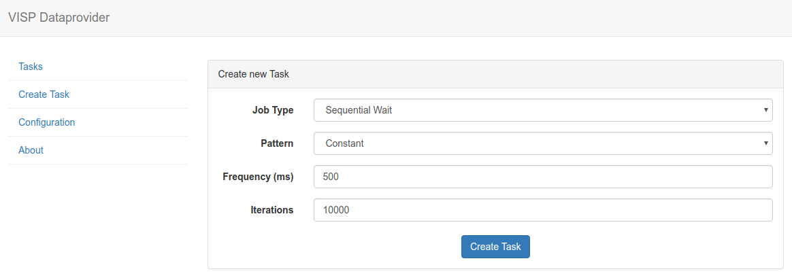

<div id="toc"></div>


# Download

<div class="section-block">

<a class="btn btn-primary btn-cta" href="https://github.com/visp-streaming/runtime">
<i class="fa fa-cloud-download"></i> Download the source code  from GitHub</a></div>


# Infrastructure Host

Let's start with the infrastructure host. This is the machine where the RabbitMQ, MySQL and Redis services will be running. Make sure that docker is installed and configured on that machine and run the following commands to set everything up:

<!--
<div class="callout-block callout-info">
<div class="icon-holder">
<i class="fa fa-info-circle"></i>
</div>
<div class="content">
<h4 class="callout-title">Info</h4>
<p>
<code class="highlighter-rouge">--net="host"</code> specifies that the runtime has direct access to the containers via their ports
</p>
</div>
</div>
-->

### Start Redis
```
docker run --net="host" -d --name redis -p 6379:6379 redis
```

### Start RabbitMQ
```
docker run --net="host" -d --name rabbitmq -e RABBITMQ_DEFAULT_USER=visp -e RABBITMQ_DEFAULT_PASS=visp -p 15672:15672 -p 5672:5672 rabbitmq:3-management
```


### Start MySQL
```
docker run --net="host" -d --name mysql -e MYSQL_ROOT_PASSWORD=visp -e MYSQL_DATABASE=visp -p 3306:3306 mysql
```

# Configuration

Before the VISP runtime can be executed, the following configuration is necessary:


## Credentials

Make a copy of the `credential.sample.properties` file and name it `credential.properties`. The following credentials must be specified:


<table class="table">
  <thead>
      <tr>
          <th>Property</th>
          <th>Value</th>
      </tr>
  </thead>
  <tbody>
      <tr>
          <th scope="row">os.auth.url</th>
          <td>&lt;URL of OpenStack, e.g. `http://openstack.infosys.tuwien.ac.at/identity/v2.0`&gt;</td>
      </tr>
			<tr>
          <th scope="row">os.tenant.name</th>
          <td>&lt;The name of the OpenStack project&gt;</td>
      </tr>
			<tr>
          <th scope="row">os.username</th>
          <td>&lt;OpenStack username&gt;</td>
      </tr>
			<tr>
          <th scope="row">os.password</th>
          <td>&lt;OpenStack password&gt;</td>
      </tr>
			<tr>
          <th scope="row">os.keypair.name</th>
          <td>&lt;Name of an available SSH keypair&gt;</td>
      </tr>
			<tr>
          <th scope="row">spring.datasource.username</th>
          <td>root</td>
      </tr>
			<tr>
          <th scope="row">spring.datasource.password</th>
          <td>visp</td>
      </tr>
			<tr>
          <th scope="row">spring.rabbitmq.username</th>
          <td>visp</td>
      </tr>
			<tr>
          <th scope="row">spring.rabbitmq.password</th>
          <td>visp</td>
      </tr>

  </tbody>
</table>

The spring credentials for the database and rabbitmq can be kept the same if no changes were made during the container deployment process in the setup of the infrastructure host.

## Database IP

Just in case the VISP Runtime is executed on a host *different* from the host where rabbitmq and MySQL are running, it is possible to specify the database IP manually. This is possible by creating a `database.properties` file in the application root that contains the IP of the host where the MySQL server is running.

# Run VISP

The easiest way to run VISP is by using a docker image.

## Required Software

Before the build process can be started, the following software must be installed:

* Java 8 (tested with Oracle Java 1.8.0_111)
* Apache Maven (tested with 3.3.9)

## Building the Docker Container

In order to generate a docker image for the runtime, use this maven command (important: make sure to correctly set the credentials.properties and application.properties before pushing as described earlier):

```
docker login
mvn clean package docker:build -DpushImage -Dmaven.test.skip=true
```

The first command is used to log into your dockerhub account. Then the maven project is built and pushed to the dockerhub repository specified in pom.xml. Change this to your own repository by modifying the pom.xml:

```
<configuration>
  <useConfigFile>true</useConfigFile>
  <imageName>{dockerhub-username}/{dockerhub-repository}</imageName>
...
</configuration>
```

Once the image has been successfully pushed to the dockerhub repository, the following command can be used to run a docker container based on the pushed image:

```
docker run --net="host" -d --name vispruntime {dockerhub-username}/{dockerhub-repository}
```


# Running VISP from Source

You can also download the VISP source code and run it directly via Maven. After configuring the two properties files as described above, run the following maven command in the project root:

```
mvn spring-boot:run
```


# Setup VISP

## Creating Resource Pools

Once the infrastructure host is up and running, a resource pool needs to be created. Resource pools are basically cloud computing instances where docker containers are executed. Open the web interface of the infrastructure host (`http://<infrastructureHost>:8080/`) and navigate to <b>Resource Pools</b>. Initially, there should be no entries. Create a new pool by clickin on the <b>Add new pooled VM</b> button and specify a name, an instance flavour and a cost. The name is an identifier and is also used in the topology config file to distinguish different pools on the same runtime instance. The flavour reflects the amount of computational resources available and basically limits how many operators can be deployed at the same time. The cost value is currently not used.

<div class="screenshot-holder">
<a href="img/quickstart/resourcepools.png" data-title="Add new resource pool" data-toggle="lightbox"></a>
<a class="mask" href="img/quickstart/resourcepools.png" data-title="Add new resource pool" data-toggle="lightbox"><i class="icon fa fa-search-plus"></i></a>
</div>

## Deploy Topology

Topology files are used to describe which processing nodes should be deployed and how they should be connected. In order to upload a topology file, navigate to the web interface of the infrastructure host (`http://<infrastructureHoste>:8080/`) and select <b>Change Topology</b>. There you can upload a new topology file and see which topology is currently active. If the nodes should be deployed on multiple VISP runtime instances, just upload the topology on one runtime instance - VISP's distributed update process will take care of the rest and update the other runtime instances accordingly.

Here are two example topology files: <a href="./files/scenario1.txt">scenario1</a> and <a href="./files/scenario2.txt">scenario2</a>.

Importantly, the IP addresses of the VISP runtimes need to be adjusted. In both cases, the operators are deployed on different runtimes to show how to specify such a behavior. Of course it is also possible to deploy all operators on one single VISP runtime instance (the only limitation is the number and size of resource pools specified).

<div class="screenshot-holder">
<a href="img/quickstart/topology_update.png" data-title="Topology update" data-toggle="lightbox"></a>
<a class="mask" href="img/quickstart/topology_update.png" data-title="Topology update" data-toggle="lightbox"><i class="icon fa fa-search-plus"></i></a>
</div>

The above figure shows the result of a topology update where six operators (one source, one sink, four processing operators) are deployed on two different VISP runtime instances. The automatically generated graphic shows the runtime instance and resource pool where each operator is deployed.

# Testing VISP

In order to evaluate whether the set up topology is actually working properly, we have developed the <b>VISP Data Provider</b> tool. This tool allows automatically generating input data for a configurable VISP runtime instance.

## Download

<div class="section-block">
You can download the source code from Github: <br /><br />

	<a class="btn btn-primary btn-cta" href="https://github.com/visp-streaming/dataProvider">
	<i class="fa fa-cloud-download"></i> VISP Data Provider</a>
</div>

## Run Data Provider

The data provider can be executed by running the following maven command

```
mvn spring-boot:run
```

## Stream Data

Before the data stream can be started, the configuration has to be adapted. Navigate to the VISP Data Provider web interface: `http://localhost:8090/`

There, enter the public URI of the VISP Runtime where the target source operator is located. E.g., if the source that should be addressed is deployed at a VISP runtime `128.130.172.222`, enter that IP.

Username and password are the credentials for the rabbitmq server that were set during the docker deployment of the infrastructure host.

Once the credentials are configured, navigate to *Create Task*, pick a template (e.g. SequentialWait) and specify the frequency and number of iterations. The template decides which queue is targeted and what kind of data is sent.

<div class="screenshot-holder">
<a href="img/quickstart/dataprovider.png" data-title="Configure Data Provider" data-toggle="lightbox"></a>
<a class="mask" href="img/quickstart/dataprovider.png" data-title="Configure Data Provider" data-toggle="lightbox"><i class="icon fa fa-search-plus"></i></a>
</div>


## Observe the Data Processing

To see whether the generated data is processed correctly, you can open the rabbitmq web interface on the corresponding infrastructure hosts. For example, navigate to `http://128.130.172.201:15672/#/queues` (replace the IP with the actual infrastructure host).

Each communication link between two operators is represented by a single queue that is named according to the following schema:

```
128.130.172.201/source>step1
```

The first part represents the sending operator's VISP runtime IP. Separated by a slash follows the sending operator's ID. Finally, a *greater than* sign precedes the receiving operator's ID.


# Fine tuning

TBD: discuss all other attributes in application.properties as well as in the configuration menue

<!--Setting the IPs correctly is critical: `VISP_RUNTIME_IP` is the public IP of the VISP runtime. This is also the IP that is used in the configuration file to distinguish different runtimes. In practise, it is the IP of the OpenStack instance where the above command is executed. All the other IPs must be set to `127.0.0.1` if deployment is done via docker on OpenStack. The reasons is that OpenStack instances cannot access themselves by their own public IPs (at least in our version).-->
